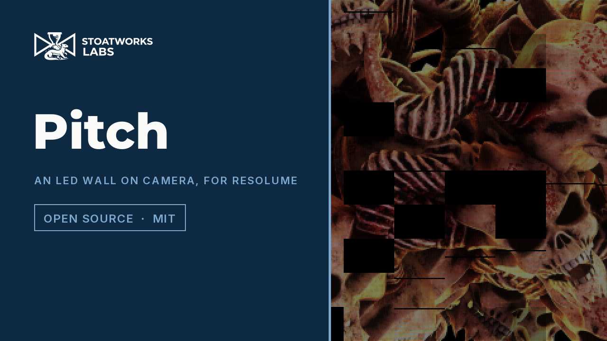

# pitch

> **AI-assisted project.** This codebase was created with [Claude](https://claude.com/claude-code)
> (Anthropic), directed and reviewed by a human author. The physics is not asserted
> but measured: an offline harness drives the real plugin class in a headless GL
> context and checks each claim against its closed form — the moiré fringe period
> is `1 / |s − round(s)|` pixels by DFT, the scan-band period is `P / (Tr / H)` rows
> and a shutter of whole refresh periods leaves no band at all, the band depth
> follows the closed-form overlap and is worst at low grey, the optics conserve
> light to float precision, a dead cabinet is exactly black and exactly aligned,
> and the neutral settings return the input byte for byte — with negative controls
> that prove a detuned overlap integral and a swapped Bayer phase are caught. It
> has **never been loaded into Resolume on macOS**. On Windows, a build of v0.1.0
> loads, registers and renders in Resolume Arena 7.27.1 with every control as
> declared, on software rendering. See [Status](#status).

An LED wall seen through a camera, as an FFGL effect for [Resolume](https://resolume.com)
Arena and Avenue.


<sub>One frame, rendered by `pitest`, the offline harness — not captured from Resolume.
A 1.25-pixel-pitch wall at 0.8 LEDs per sensor pixel, one degree off square, 1/4
scan through a 1/1600 shutter, with a fifth of the cabinets faulted.</sub>

<!-- downloads:start -->

## Download

**[v0.1.0](https://github.com/stoatworks-labs/pitch/releases/tag/v0.1.0)** — prebuilt for macOS and Windows. Pick your platform:

<details>
<summary><b>macOS</b> — Universal (Apple Silicon + Intel)</summary>

| Build | Download | Size |
| --- | --- | --- |
| Universal (Apple Silicon + Intel) · .dmg disk image | [`pitch-0.1.0-macos-universal.dmg`](https://github.com/stoatworks-labs/pitch/releases/download/v0.1.0/pitch-0.1.0-macos-universal.dmg) | 216 KB |
| Universal (Apple Silicon + Intel) · .zip archive | [`pitch-macos-universal.zip`](https://github.com/stoatworks-labs/pitch/releases/latest/download/pitch-macos-universal.zip) | 179 KB |

</details>

<details>
<summary><b>Windows</b> — x64</summary>

| Build | Download | Size |
| --- | --- | --- |
| x64 · .exe installer | [`pitch-0.1.0-windows-x86_64-setup.exe`](https://github.com/stoatworks-labs/pitch/releases/download/v0.1.0/pitch-0.1.0-windows-x86_64-setup.exe) | 222 KB |
| x64 · .zip archive | [`pitch-windows-x86_64.zip`](https://github.com/stoatworks-labs/pitch/releases/latest/download/pitch-windows-x86_64.zip) | 114 KB |

</details>

All builds, checksums and release notes: [github.com/stoatworks-labs/pitch/releases](https://github.com/stoatworks-labs/pitch/releases).

macOS builds are signed and notarised and open normally. The Windows builds are unsigned, so SmartScreen warns once.

<!-- downloads:end -->

## The one idea

Every IMAG camera pointed at an LED wall samples a grid with a grid — twice.

In **space**: the wall is a lattice of small emitters with black between them, and
the sensor is a second lattice behind a Bayer mosaic. In **time**: the wall is lit
one scan group at a time and makes grey by pulse-width modulation, and each sensor
row integrates its own slice of that pulse train as the rolling shutter slides down
the frame.

So every pixel is a small box laid over the LED grid, and every row is a window laid
over the pulse train. The plugin integrates both — analytically, not by sampling —
and that is the whole plugin.

## What falls out

None of these is drawn. Each is one of the two samplings applied to something:

- **Moiré.** The LED lattice at *s* LEDs per pixel aliases against the pixel lattice
  to a fringe `1 / |s − round(s)|` pixels long. It swims when `Camera Scale` moves,
  and it is coloured because the Bayer mosaic samples red and blue a pixel apart —
  half a cycle, near Nyquist. `Focus` kills it, because a lens blurs *before* the
  sensor samples, which is the only place a blur can remove aliasing.
- **Scan bands.** Row *r* of *H* integrates from `r × Readout / H` for one `Shutter`.
  Against a pulse train of period *P* the rows band with a period of `P / (Readout / H)`
  rows. Set the shutter to a whole number of refresh periods and the band depth is
  zero — the operator's rule, and here it is a theorem rather than a tip.
- **Low-grey breakup.** A dark level is a short pulse, and a short pulse is either
  caught or missed by a window, so the relative band depth is highest at low grey.
  `Scrambled` PWM spreads the same on-time over sixteen sub-periods and the depth
  falls by about that factor.
- **Black between the pixels.** `Fill Factor` is the emitting fraction of each cell.
  Zoom in and the pixels separate; zoom out and the light is the same.
- **Cabinet seams.** A seeded draw per cabinet: dead, dim (a gain, which leaves a
  visible seam), a dead row in one module, or a colour bin a shade off.

`Pitch 1`, `Fill Factor 1`, `Camera Scale 1`, a shutter of whole periods and Bayer
off is the identity, to the byte.

### The honest limit

The wall drives its PWM with the clip's code values. A real processor applies a
gamma first, so a real wall's dark pulses are shorter still and its low-grey breakup
worse than modelled here. The sensor integrates the LEDs exactly but the LEDs
themselves are square emitters with hard edges; a real chip has a radiation pattern
and the lens has an MTF beyond the disc modelled by `Focus`. Under `Rotation` the
pixel's footprint is approximated by nine axis-aligned boxes rather than one rotated
square. And a pixel that holds more than three LEDs a side reads a prefiltered mean
instead of walking every emitter, which is what a real lens would have done anyway.

[](https://www.youtube.com/watch?v=FOQa3280HJ8)

*[Watch it](https://www.youtube.com/watch?v=FOQa3280HJ8) — 53 seconds:
black opening up between the LEDs, moiré swimming as the camera backs off and dying under Focus, scan bands standing at 60 fps and crawling at 59.94, a whole-period shutter clearing them, Scrambled PWM taking the low-grey bands away, and a seeded bad day of dead cabinets. Every frame is the real plugin's output: an FFGL plugin has no window,
so the footage is rendered by this repository's own offline harness
(`pitest --pipe`, driven by a cue sheet) rather than filmed off a screen, and
the clips are Resolume's bundled demo media.*

## Try it in your browser

**<https://pitch-demo.stoatworks-labs.com>**

Not the plugin — the five shaders from `source/Shaders.cpp`, copied across unedited and
run in WebGL2, with the plugin's own controls, groups and defaults. The small CPU half
(the control conversions, the wall's cabinet count and origin, the per-row exposure
windows in PWM sub-periods, the frame-period estimate) is a hand port to JavaScript
that nothing but a reader checks; `demo/tools/check_shaders.py`, run by
`tools/verify.sh`, fails if a character of the shaders drifts. The integer controls are
sliders there, the host-clock unit voting is absent, and a browser that cannot filter a
32-bit float texture keeps the wall at RGBA16F and says so. The page lists every
difference at its foot.

## Controls

| Group | |
| --- | --- |
| **Wall** | Pitch (1–16 source px per LED), Fill Factor, LED Layout (3-in-1 SMD or Discrete RGB), Cabinet W, Cabinet H (LEDs), Module Rows. |
| **Drive** | Refresh (240–7680 Hz), Scan Ratio (1/1 … 1/32), Grey Bits (4–16), PWM (Conventional or Scrambled), Refresh Phase. |
| **Camera** | Camera Scale (0.125–8 LEDs per pixel: zoom and distance in one number), Rotation (±10°), Focus (a blur disc of 0–4 px), OLPF, Shutter (1/8000–1/24 s), Readout (4–40 ms), Frame Rate, Bayer On. |
| **Faults** | Fault Rate, Dead, Dim, Dead Row, Bin Shift, Fault Seed. Each kind's control is both how often it happens and how badly. |
| **Output** | Mix. |

The wall is a whole number of cabinets, the nearest whole number to what the clip
holds at the chosen pitch, centred on the clip. At the defaults — a 4-pixel pitch
seen at a quarter of an LED per pixel — the wall fills the frame and the pixel
structure shows; the moiré arrives the moment Camera Scale moves.

## Status

**v0.1.0, and honestly early — 23 September 2026.**

### Measured offline, on macOS

`tools/verify.sh` passes on this machine (M4 Max, macOS 26.4.1) against a fresh
universal Release build, running every check at **two rasters**, 320×180 and
1280×720; the same checks also pass at 1920×1080. What it establishes, in numbers:

| check | result |
| --- | --- |
| `--identity` | the neutral settings return the test card at **0/255** deviation, at every raster; the negative control (fill 0.5) differs by 128/255 |
| `--energy` | the frame mean equals fill × level × wall area to **2.6e-8** with Focus off and **1.9e-8** with a 1.5 px blur disc on, against a float tolerance of 2.2e-6 |
| `--moire` | at 0.8 LEDs/px the DFT peak is bin 32 of 160 = **5.00 px**, expected 5.00, contrast 0.126; at 1.25 LEDs/px bin 40 = **4.00 px**, expected 4.00; at 1.0 the contrast is **1e-5**; a 1.5 px blur drops the 0.126 to **0.0099** (floor 0.05, from the disc's MTF of 0.037 at the fundamental) |
| `--bands` | the band period is DFT bin **20** at every raster (9 rows at 180, 36 at 720, 54 at 1080), as `P / (Tr / H)` says; depth **0.20000** against a closed form of 0.20000; at a two-period shutter the depth is **1.2e-7** |
| `--pwm` | relative band depth **0.769 > 0.460 > 0.084** at 10%, 50%, 90% grey under Conventional, each within 1e-4 of the closed-form overlap; **0.019** under Scrambled at 50% |
| `--faults` | 26 of 50 cabinets (372 of 800 at 720p) exactly black and exactly cabinet-aligned, 0 stray pixels; dead rows exactly one row and cabinet-wide; the same seed is byte-identical twice and another seed differs |
| `--bayer` | Bayer off is neutral at every pixel; at each mosaic site the demosaic returns the sensor's own channel to **0/255**; colour moiré `|R − B|` reaches **36/255** on a white wall |
| `--negative` | the overlap integral detuned by 10% **fails** `--bands` and `--energy`; the mosaic phase swapped **fails** `--bayer` |
| mutation | one character of the shipped GLSL (`( i1 - i0 )` → `( i1 + i0 )` in the overlap) was caught by `--identity`, `--bands`, `--pwm` and `--energy`, then reverted |
| `tools/sweep.py` | all **26** swept controls measurably change the picture |
| shaders | all 5 compile through `glslc`, not merely through Apple's driver |
| the bundle | universal (`x86_64 arm64`), exports `plugMain`, ad-hoc signs; `oxbow` reports `SW Pitch` / `PI01` / `effect` and renders 120 frames through `plugMain` |

Render cost at the defaults (Bayer on), best of three runs of 60 frames after a
warm-up, `glFinish` both sides, on a GPU shared with other work: **0.74 ms** at
720p, **1.29 ms** at 1080p, **2.11 ms** at 1440p, **4.91 ms** at 4K — three tenths
of a 60 fps frame at 4K. Rotation costs nine boxes per pixel instead of one, and Focus
thirty-two disc taps per box; both are off by default. macOS figures only.

### Not established

It has **never been loaded into Resolume on macOS**. Everything above was compiled,
rendered and measured offline against the real plugin class in a headless CGL context,
plus an `oxbow` load. How the controls present in Arena's inspector on macOS, whether
the integer cabinet fields type sensibly, and what the host's clock does to the band
phase over a long session are all untested. Nothing has been through a show. No
OpenFX port (not in scope for 0.1.0). The
[browser demo](https://pitch-demo.stoatworks-labs.com) runs the plugin's own shaders, but its
small CPU half is a hand port that only a reader checks.

**Windows, in Resolume Arena 7.27.1** (win-lab, Mesa llvmpipe, no GPU, 2026-09-23):
a CI build of this source loads from Extra Effects, registers as `SW Pitch` / `PI01` /
effect, all 32 host controls match the declaration in name, order, type, range and
default, it renders, and Arena's log stays clean: 9 of 9 of the fleet gate's checks.
20 controls moved the picture; 7 were inconclusive (Scan Ratio, Grey Bits, Refresh
Phase, Readout, Frame Rate, Module Rows, Dead Row), because the gate compares single
frames of a still picture and those act on the time-varying scan bands or on one row
per cabinet; `tools/sweep.py` proves all of them live. Software rendering says nothing
about a GPU or about speed.

The [user guide](docs/USER-GUIDE.md) covers every control, what it does and why.

## Build

Needs CMake 3.15+, a C++17 compiler, and the FFGL SDK submodule.

```bash
git clone --recursive https://github.com/stoatworks-labs/pitch
cd pitch
cmake -B build -DCMAKE_BUILD_TYPE=Release
cmake --build build --parallel
cmake --install build     # into ~/Documents/Resolume Arena/Extra Effects
```

macOS builds are universal (Apple Silicon + Intel) by default; add
`-DCMAKE_OSX_ARCHITECTURES=arm64` for a faster dev build. Windows needs GLEW via vcpkg.

## Building and testing

The offline harness renders the real plugin class headlessly, on a synthetic 60 fps
clock:

```bash
./build/pitest --out /tmp/frame.png --size 1920x1080   # the test card
./build/pitest --list                                  # every control, kind and default
./build/pitest --identity --energy --moire             # each claim, measured
./build/pitest --bands --pwm --faults --bayer
./build/pitest --negative                              # and the checks can fail
./build/pitest --bench                                 # 720p through 4K
python3 tools/sweep.py                                 # no control is silently dead
tools/verify.sh                                        # all of it, on a fresh universal build
```

Every check takes `--size`; run it at 320×180 as well as the raster you care about.
Footage goes through the real shaders with `--pipe`, in the fleet's frame format:

```bash
ffmpeg -i in.mov -f rawvideo -pix_fmt rgba - \
  | ./build/pitest --pipe --size 1920x1080 --script cues.txt \
  | ffmpeg -f rawvideo -pix_fmt rgba -s 1920x1080 -i - out.mov
```

See [`CLAUDE.md`](CLAUDE.md) for the full command reference and
[`AGENTS.md`](AGENTS.md) for the model and the traps.

<!-- attributions:start -->
This project is built on other people's work — see [ATTRIBUTIONS.md](ATTRIBUTIONS.md).
<!-- attributions:end -->

## Licence

MIT — see [LICENSE](LICENSE).
