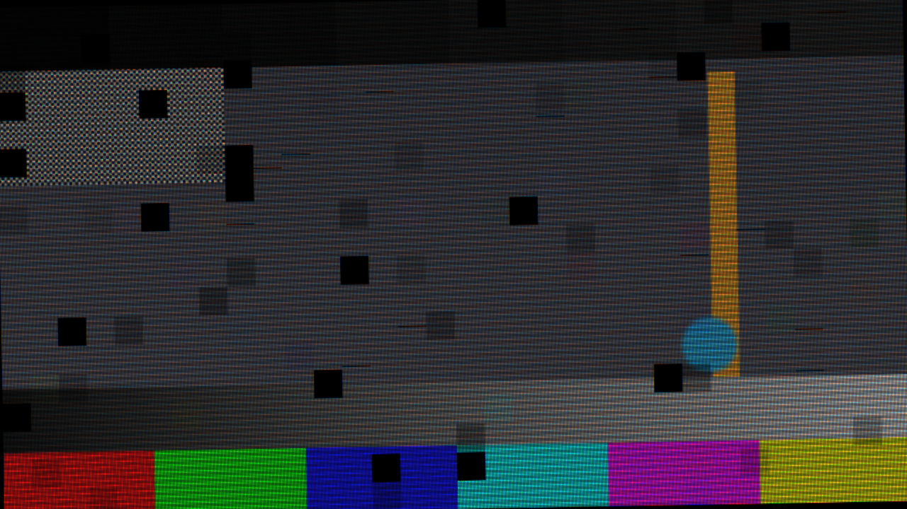

# Pitch user guide

Pitch is **an LED wall seen through a camera, for [Resolume](https://resolume.com) Arena and
Avenue**, as an FFGL effect. It does not paint moiré, scan lines or dead tiles onto a clip. It
builds a wall of small emitters with black between them, lights it the way an LED processor
does, one scan group at a time by pulse-width modulation, and then photographs that wall with a
camera that has a rolling shutter and a Bayer sensor. Moiré, rolling bands, low-grey breakup and
cabinet seams are all what those two samplings do. None of them is drawn.



*The harness's test card through the plugin, rendered by the offline harness rather than
captured from Resolume. A 1.25-pixel-pitch wall at 0.8 LEDs per sensor pixel, one degree off
square, 1/4 scan through a 1/1600 shutter, with a fifth of the cabinets faulted.*

> **Before you rely on this:** released at **v0.1.0**, and honestly early. The physics is
> measured rather than asserted, by a harness that drives the real plugin class: at 0.8 LEDs per
> pixel the moiré fringe measures 5.00 px by DFT against 5.00 predicted; the scan-band period
> lands on the predicted DFT bin at every raster tested, with a depth of 0.20000 against a closed
> form of 0.20000, and a shutter of two whole refresh periods leaves a band 1.2e-7 deep; relative
> band depth falls from 0.769 at 10% grey to 0.084 at 90%, and to 0.019 under Scrambled PWM; the
> optics conserve light to 2.6e-8; a dead cabinet is exactly black and exactly cabinet-aligned;
> and the neutral settings return the input with 0/255 deviation. All 26 controls measurably
> change the picture. It has **never been loaded into Resolume on macOS**. The one host it has
> run in is the fleet's own test host, `oxbow`, for 120 frames.
> On Windows, a build of v0.1.0 loads, registers and renders in Resolume Arena 7.27.1, with every control matching what the plugin declares — on software rendering, so that says nothing about a GPU. Seven controls that act on the moving scan bands or on one row per cabinet (Scan Ratio, Grey Bits, Refresh Phase, Readout, Frame Rate, Module Rows, Dead Row) could not be shown moving there on a still picture.
> Try it on a spare layer before you put it in a show.
>
> This codebase was created with AI assistance, directed and reviewed by a human author.

---

## Installing

Every download carries one effect, **SW Pitch**. Drop it into Resolume's effects folder and
restart Resolume:

```
macOS    ~/Documents/Resolume Arena/Extra Effects/
Windows  %USERPROFILE%\Documents\Resolume Arena\Extra Effects\
```

Avenue uses the same layout under its own folder name. The effect then appears in the effects
browser as **SW Pitch**.

The macOS download is a universal build (Apple silicon and Intel), as a `.dmg` or a `.zip`. It is
**Developer ID-signed and notarised**, so the bundle simply loads. The
Windows download is an x64 installer or a `.zip`. It is not code-signed, so the installer trips
SmartScreen once: **More info** → **Run anyway**.

---

## This is the wall *and* the camera

Most looks of this kind do one or the other: a grid over the picture for the wall, or some
lines and a colour fringe for the camera. Pitch does both, in that order, because the artefacts
an operator fights on a show only exist when both are present. Moiré is the wall's lattice
beating against the sensor's. Scan bands are the wall's pulse train caught by the camera's
rolling shutter. Neither lattice alone makes a moiré, and neither the wall nor the shutter alone
makes a band.

So the controls come in two halves. **Wall** and **Drive** are the LED product and its
processor: how big the pixels are, how much of each cell emits, how it is scanned and at what
refresh. **Camera** is what is pointed at it: how many LEDs land on a sensor pixel, the shutter,
the readout, the sensor's colour mosaic. **Faults** is the wall on a bad day. Change the wall and
the camera sees something different; change the camera and the same wall photographs
differently. That is the effect.

There is no display at the end. What comes out is the camera's picture.

---

## Start here

Put SW Pitch on a layer with something in it and leave every control alone. The defaults are
**a 4-pixel-pitch wall of 32×32-LED cabinets at 3840 Hz and 1/16 scan, seen at a quarter of an
LED per sensor pixel through a 1/1000 shutter on a 60 fps camera**. That makes each LED four
sensor pixels across with black between them. The wall fills the frame, the pixel structure
shows, and there is no moiré yet, because at four pixels per LED the camera resolves every
emitter.

Then, in this order:

1. **Camera Scale.** Push it up. This is zoom and distance in one number, in LEDs per sensor
   pixel. As it passes about half an LED per pixel the individual LEDs stop resolving and a
   moiré arrives. It swims as the slider moves, and it is coloured. The wall also shrinks towards
   the middle of the frame, because the camera is backing away from it. To keep it filling the
   frame, bring **Pitch** down as you go: the wall fills the frame when Pitch × Camera Scale is
   about 1. The picture above is Pitch 1.25 at Camera Scale 0.8.
2. **Shutter.** Push it towards 1/8000 and the rolling bands deepen. A shutter of a whole number
   of refresh periods has no band at all, which is the operator's rule on a real shoot. At
   3840 Hz, 1/1920 is two periods and 1/960 is four.
3. **Frame Rate.** Set it to **59.94** and the bands start to crawl. At 60 they stand still,
   because a 60th of a second is exactly 64 refresh periods at 3840 Hz. A real 59.94 camera on
   a 60-locked wall crawls in the same way.
4. **Fault Rate.** Raise it and some cabinets die, dim, lose a row of LEDs or shift colour.

**Be honest about the input.** Bands need grey. An LED at full level is on for the whole refresh
period, so there is nothing for a shutter to catch or miss, and a picture of pure saturated
primaries shows no bands in those colours at all. A real wall at full white behaves the same
way. Mid and low greys band the most, which is also where a real wall breaks up.

Two formulas carry most of the instrument:

- **Moiré fringe = 1 / | s − round( s ) | pixels**, at *s* LEDs per pixel (Camera Scale). At 0.8
  that is 5 px, at 0.9 it is 10, and at 1.25 it is 4. Close to a whole number the fringe is long
  and wide. At exactly one LED per pixel, square on, every pixel holds exactly one cell and the
  lattice disappears into flat light.
- **Band period = refresh period ÷ ( Readout ÷ rows )**, in sensor rows. At the defaults on a
  1080-row picture that is about 17.6 rows.

---

## Time comes from the host

The bands depend on *when* each sensor row was exposed against the wall's refresh, so the effect
reads the host's clock. A re-render of the same composition frame bands the same frame the same
way.

Every composition frame is treated as one camera frame at the camera's **Frame Rate**. The bands
therefore move per frame as they would on that camera, whatever rate the composition renders at.
They stand still when Refresh ÷ Frame Rate is a whole number (under Scrambled PWM, sixteen
times Refresh ÷ Frame Rate), and crawl otherwise.

For the first few frames after it loads, the effect runs on its own steady clock while it works
out whether the host counts time in seconds or milliseconds. Then it switches to the host's.

---

## The Wall group

**Pitch** — how many **source** pixels become one LED, from 1 to 16. The travel is geometric:
2 at a quarter of the way, 4 in the middle (the default), 8 at three quarters. Each LED takes the
mean of the clip under it, so a large pitch is a coarse wall. At 1, the wall has one LED per
clip pixel. This sets the wall's resolution. How big the wall appears in the camera's picture
depends on Camera Scale as well.

**Fill Factor** — the fraction of each LED cell that emits, from 0.05 to 1, linear. The default
is 0.5. The emitter is a square in the middle of its cell with black round it. Turn it down and
the LEDs become points in a black grid. Up at 1 there is no black between them at all. The total
light scales with the fill, as on a real product: a low-fill wall is a darker wall.

**LED Layout** — **3-in-1 SMD** or **Discrete RGB**.

- **3-in-1 SMD** — each LED is one square emitting all three colours from the same place.
- **Discrete RGB** — each LED is three vertical strips side by side, red, green and blue, each a
  third of the emitter's width and three times as bright. From a distance it is the same light.
  When the camera is close enough to resolve the chips, it sees coloured stripes, and they
  saturate.

**Cabinet W** and **Cabinet H** — the cabinet size in LEDs, 8 to 256 each, default 32×32. The
wall is a whole number of cabinets: the nearest whole number to what the clip holds at this
Pitch, at least one, centred on the clip. LEDs that fall outside the clip are lit black. Cabinet
size changes nothing visible on a healthy wall except where the wall's edges fall. It matters as
soon as there are faults, because every fault belongs to a cabinet.

**Module Rows** — LED rows per module, 2 to 64, default 16. A module is a full cabinet wide.
This only matters for the **Dead Row** fault, which kills one LED row in one module of a cabinet.
A 32-row cabinet with 16-row modules has two modules.

---

## The Drive group

What the LED processor does with the picture. The wall makes grey by switching each LED on for
a fraction of every refresh period, and lights one scan group of rows at a time.

**Refresh** — how often the whole PWM pattern repeats, 240 to 7680 Hz. The travel is geometric,
one octave every fifth of the way: 240, 480, 960, 1920, 3840 (the default, at 0.8) and 7680 at
the top. A higher refresh gives shorter bands, more of them, and shallower.

**Scan Ratio** — **1/1**, **1/2**, **1/4**, **1/8**, **1/16** (the default) or **1/32**. On a 1/*S*
wall, the LED rows take turns: each row is lit only in its own *S*th of the refresh period, and
row groups next to each other are lit at different moments. Over a whole period the wall is
exactly as bright at any scan ratio. What changes is that the light arrives in shorter pulses, so
a short shutter catches some rows and misses others, and the bands deepen.

**Grey Bits** — the processor's grey depth, 4 to 16 bits, default 12. Each LED's level is rounded
to one of 2^bits − 1 steps before it becomes a pulse width. Turn it down to 4 or 5 and smooth
gradients step visibly.

**PWM** — **Conventional** or **Scrambled**.

- **Conventional** — one pulse per refresh period, as long as the level asks for.
- **Scrambled** — the same on-time split into sixteen evenly spaced short pulses, so the visible
  refresh is sixteen times Refresh. The bands become much finer and much shallower: the harness
  measures 0.019 relative depth at 50% grey against 0.460 Conventional. Real drivers use various
  numbers of sub-periods. Sixteen is enough to show the effect.

**Refresh Phase** — where in its refresh period the wall was when the camera started, as a
fraction of the period. It slides the bands up or down the frame without changing them. Its two
ends are the same phase.

---

## The Camera group

**Camera Scale** — LEDs per sensor pixel, 0.125 to 8. The travel is geometric: 0.25 at a sixth
(the default), 0.5 at a third, **exactly 1 in the middle**, 2 at two thirds, 8 at the top. It
stands for zoom and distance together. Below about 0.5 the camera resolves every LED and you see
the grid. Between about 0.5 and 3 the lattice aliases into moiré. Past 3 LEDs per pixel a side,
each pixel averages a whole patch of LEDs (as a real lens would have blurred them long before),
the moiré is gone, and only a 1/1-scan wall still bands. The camera is centred on the wall, so
the wall appears larger or smaller about the middle of the frame. It fills the frame when Pitch
× Camera Scale is about 1.

**Rotation** — the camera's roll against the wall, −10° to +10°, exactly square in the middle,
one degree for every twentieth of the travel. A small rotation turns the moiré's straight
fringes into slanted ones, as it does on a real shoot. Under rotation each pixel is approximated
by nine smaller boxes, which costs about nine times the render time of the sensor pass.

**Focus** — a blur-disc radius on the sensor, from 0 to 4 pixels. The bottom of the travel is
exactly sharp. After that the travel is geometric from 0.05 px: about 0.5 px at 0.53, 1 px at
0.68, 1.5 px at 0.78. The blur happens *before* the sensor samples, which is the only place a
blur can remove aliasing, and so this is what kills the moiré. The harness measures a 1.5 px disc
taking the fringe at 0.8 LEDs per pixel from 0.126 contrast to 0.0099. It costs 32 taps per
pixel.

**OLPF** — the sensor's optical low-pass filter: four copies of the image one pixel pitch apart,
the textbook four-spot filter. It softens the moiré without blurring as much as Focus does. Off
by default.

**Shutter** — the exposure time, 1/8000 to 1/24 s. The travel is geometric in the denominator,
and the default is 1/1000. Each sensor row integrates the wall's light over this window. A
shorter shutter catches less of each pulse train and bands more deeply. A shutter of a whole
number of refresh periods catches every LED's full cycle and does not band at all.

**Readout** — how long the sensor takes to read every row, from 4 to 40 ms, geometric. The
default is 16 ms. Row *r* of the picture starts its exposure *r* × Readout ÷ rows after the top
row does. That slide is the rolling shutter. A longer readout stretches the bands taller.

**Frame Rate** — the camera's rate: **23.98**, **24**, **25**, **29.97**, **30**, **50**,
**59.94** or **60** (the default). See *Time comes from the host*. Pick a rate that does not
divide the refresh and the bands crawl.

**Bayer On** — the sensor's colour mosaic, on by default. Each sensor pixel records only one
colour, in an RGGB pattern, and a plain bilinear demosaic fills in the other two from its
neighbours. That is what makes the moiré *coloured*: red and blue sample the same fringe a pixel
apart. Off, every pixel sees full colour, the moiré is grey, and the effect is a little cheaper.

---

## The Faults group

Each cabinet draws its faults from the seed, independently for each kind, so one cabinet can be
both dim and colour-shifted, as a real one can.

**Fault Rate** — the master: the fraction of cabinets that carry a fault of a kind whose amount
is at the top. At zero (the default) the wall is healthy whatever the controls below say.

Each of the next four controls means **both how often and how badly**. A kind appears in a
cabinet when its draw falls under Fault Rate × that control.

**Dead** — the whole cabinet goes black. Default 0.3.

**Dim** — the cabinet runs darker, by between a quarter and three quarters of the Dim amount, so
a run of dim cabinets is not all the same shade. The seams are visible because a dim cabinet is a
gain. Default 0.5.

**Dead Row** — one LED row in one module of the cabinet goes black, across the cabinet's full
width. Which module and which row are drawn from the seed. Default 0.3.

**Bin Shift** — the cabinet's LEDs come from a different colour bin. Each channel drifts by up to
a fifth of the amount either way, independently, so the cabinet is a shade off. Default 0.5.

**Fault Seed** — 0 to 999, default 1. The same seed gives the same faults in the same cabinets,
every time. Change it for a different bad day.

---

## The Output group

**Mix** — the camera's picture against the untouched clip. Zero is the clip as it arrived, and
the default is 1. At 1 the output is fully opaque: an LED wall is an opaque object in a camera's
picture, and the black round it and between its pixels is part of the picture, not transparency.
Below 1 the alpha is mixed towards the clip's.

There is no gamma control. See Known limits.

---

## How it works

Once a frame, in four passes:

1. **Copy.** The clip into a texture of the effect's own, with a mip chain.
2. **The wall.** One value per LED: the mean of the clip under it at **Pitch** source pixels per
   LED, aligned to whole cabinets, times whatever that cabinet's faults do.
3. **The sensor.** For every sensor pixel, a box is laid over the LED grid at **Camera Scale**.
   The light in the box is integrated exactly: each emitter's overlap with the box, times what
   that LED emitted during this row's exposure window. The emission is the overlap of the window
   with the LED's pulse train, in closed form, from its level, its scan slot, the **Refresh**,
   the **Shutter** and when the row started, which is where **Readout** comes in. Focus, OLPF
   and Rotation are several such boxes averaged.
4. **The mosaic.** With Bayer On, each pixel keeps one colour and a bilinear demosaic fills in
   the rest. Then Mix.

Nothing here samples at points. The box integral is exact, so the moiré is the true beat between
the two lattices, and the pulse overlap is exact, so a shutter of whole refresh periods leaving no
band is a fact of the arithmetic rather than a tip. With Pitch 1, Fill Factor 1, Camera Scale 1, a whole-period
shutter and Bayer off, every stage is an identity, and the clip comes back byte for byte.

---

## Performance

Measured by the offline harness on an M4 Max at the default controls (Bayer on), best of three
runs of 60 frames, on a GPU shared with other work:

| | ms/frame | % of a 60 fps frame |
| --- | --- | --- |
| 1280×720 | 0.74 | 4.4% |
| 1920×1080 | 1.29 | 7.7% |
| 2560×1440 | 2.11 | 12.7% |
| 3840×2160 | 4.91 | 29.5% |

**At 4K this is three tenths of a frame**, and an operator stacking effects will feel it. Two
controls multiply the sensor pass's cost: **Rotation** costs nine boxes per pixel instead of one,
and **Focus** costs thirty-two taps per pixel (four times that again with **OLPF** on). Both are
off by default. **Bayer On** adds one more pass. A very small **Pitch** on a very large clip
makes a very large wall. At Pitch 1 the wall has one float texel per clip pixel, and no side can
exceed 4096 LEDs. If the effect cannot allocate its buffers it does nothing and says so in the
log.

Nothing was timed inside Resolume, and nothing was timed on Windows.

---

## If it looks wrong

**Nothing seems to happen.** Check Mix. At the defaults the LED grid shows on any clip, so if
even that is missing, see *The effect does nothing at all* below.

**The wall is a small picture in the middle of a black frame, or overflows it.** Pitch × Camera
Scale is far from 1. The wall is sized in LEDs by Pitch and seen at Camera Scale LEDs per pixel.
Bring them back towards each other.

**There is no moiré.** Camera Scale is below about 0.5, where the camera resolves the LEDs, or
above about 3, where each pixel averages them. Focus or OLPF may also be taking it out. At
exactly 1 LED per pixel, square on, there is none by design.

**There are no bands.** The picture is at full level in the colours you are looking at, the
shutter is a whole number of refresh periods, PWM is Scrambled, or the refresh is high and the
shutter long. Try a mid-grey area and a shorter Shutter.

**The bands stand still.** Refresh ÷ Frame Rate is a whole number. That is locking, and a locked
camera does the same. Try 59.94.

**Cabinet W, Cabinet H or Module Rows do nothing.** On a healthy wall they only move where the
wall's edges fall. Raise Fault Rate.

**Colour fringes along every edge.** That is the Bayer demosaic. Turn Bayer On off to compare.

**The effect does nothing at all.** A shader that will not compile looks exactly like that, and
so does a wall too large to allocate. The real message is in the log:

```
macOS    ~/Library/Logs/pitch/pitch.YYYY-MM-DD.log
Windows  %LOCALAPPDATA%\pitch\logs\pitch.YYYY-MM-DD.log
```

It records the GL vendor and version at load, which shader failed if one did, and the buffer
sizes if they could not be allocated, with the advice to try a larger Pitch.

---

## Known limits

- **Never loaded into Resolume on macOS**, and nothing has driven the controls in a host. How
  26 controls in five groups read in the inspector, how the integer cabinet fields type, and what
  a long session's clock does to the band phase are untested.
- **No gamma on the wall.** The PWM is driven by the clip's code values directly. A real
  processor applies a gamma first, so a real wall's dark pulses are shorter still and its
  low-grey breakup is worse than shown here.
- **Emitters are hard-edged squares**, with no radiation pattern, and the lens has no MTF
  beyond the Focus disc. The disc is a fixed 32-tap spiral, not an ideal lens blur.
- **Rotation is approximate**: nine axis-aligned boxes stand in for each rotated pixel.
- **Past three LEDs per pixel a side** the sensor reads the wall's mean times the fill instead of
  walking every emitter.
- **Scrambled PWM is always sixteen sub-periods.** Real drivers vary.
- **The host clock handling has only met the harness's clock.** It is the same code as the
  fleet's readout effect, which has met Arena. This effect has not.
- **Not verified at 4K**, only timed there.
- **No presets** and no OpenFX version.
- **There is a browser demo** at [pitch-demo.stoatworks-labs.com](https://pitch-demo.stoatworks-labs.com).
  It is a port to a web page, not the plugin: the shaders run in WebGL2 and any CPU
  half is rewritten in JavaScript. The page lists what it does not reproduce.

---

## About

The last group, **About**, carries the plugin's name, version, licence and maker, and buttons
that open this user guide, the project page, the source on GitHub and the support page in your
browser.

## Reporting something

[github.com/stoatworks-labs/pitch/issues](https://github.com/stoatworks-labs/pitch/issues).
A screenshot, the Pitch and Camera Scale settings, and the composition's resolution and frame
rate are usually enough.
